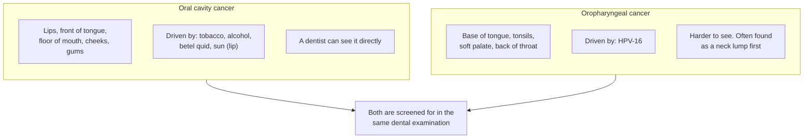
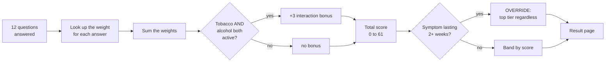
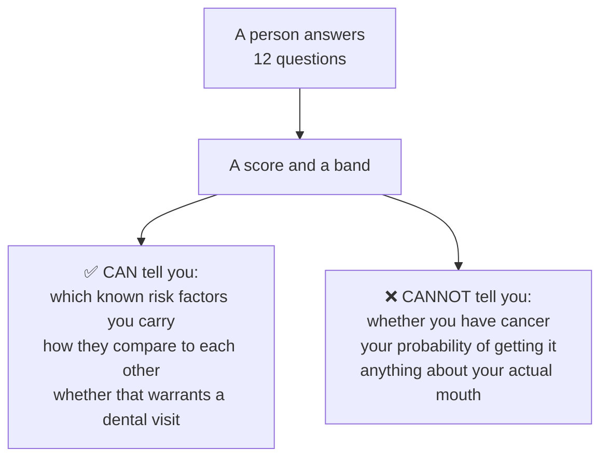
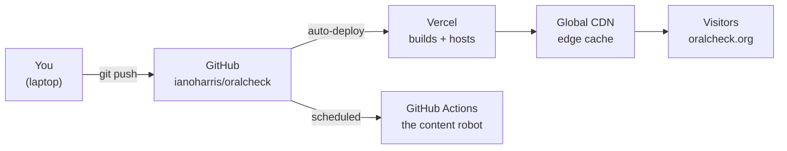
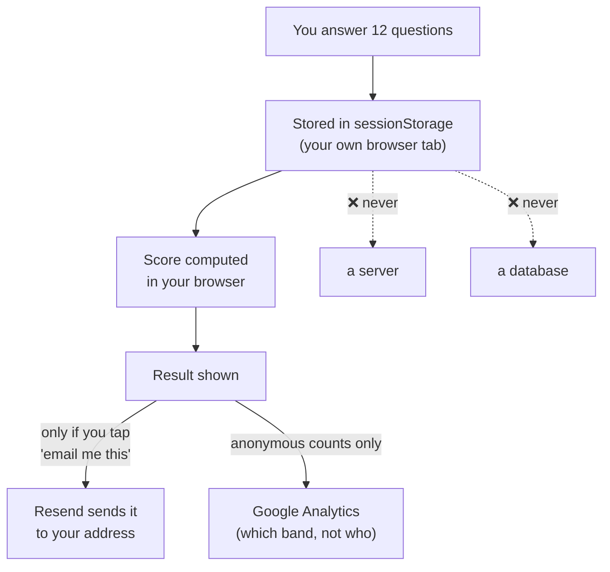
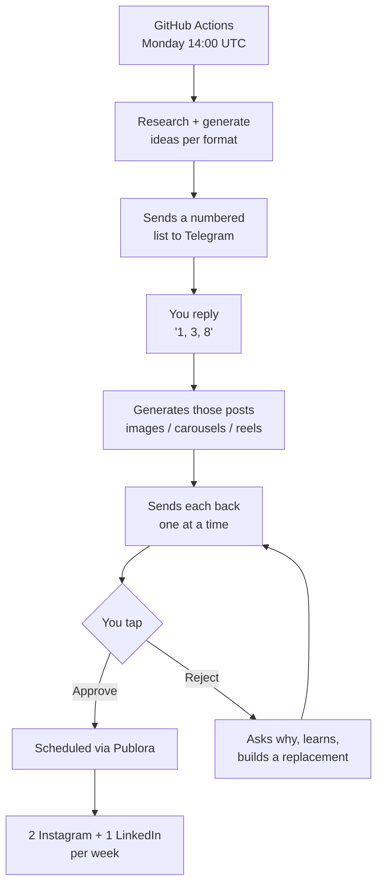

# OralCheck: the owner's guide

**Everything about your own project, in plain language.**

This exists so that when a professor, a dentist, an admissions interviewer, or a
stranger on the internet asks you a hard question about OralCheck, you already
know the answer, including the answers that aren't flattering.

Read it once end to end. After that, use the table of contents.

Last updated: **2026-09-01**
Maintained by: Claude, on request. Ask it to update this file whenever something
structural changes. See [Keeping this current](#15-keeping-this-current).

---

## Contents

1. [The 60-second version](#1-the-60-second-version)
2. [The medicine](#2-the-medicine)
3. [How the score actually works](#3-how-the-score-actually-works)
4. [Why every question is in there](#4-why-every-question-is-in-there)
5. [What it deliberately does not do](#5-what-it-deliberately-does-not-do)
6. [Decisions, and why they went that way](#6-decisions-and-why-they-went-that-way)
7. [How the site is hosted](#7-how-the-site-is-hosted)
8. [The tech, part by part](#8-the-tech-part-by-part)
9. [Privacy and security](#9-privacy-and-security)
10. [The content robot](#10-the-content-robot)
11. [Analytics: what you can and can't know](#11-analytics-what-you-can-and-cant-know)
12. [Who has looked at this](#12-who-has-looked-at-this)
13. [Questions you will get, and how to answer them](#13-questions-you-will-get-and-how-to-answer-them)
14. [What breaks, and how you'd know](#14-what-breaks-and-how-youd-know)
15. [Keeping this current](#15-keeping-this-current)
16. [Glossary](#16-glossary)

---

## 1. The 60-second version

OralCheck is a free web page that asks **12 questions** about things known to
raise oral cancer risk, adds up a score, and tells you which of four risk bands
you fall into and what to do next. It takes about two minutes. It requires no
account, and it never sends your answers anywhere.

**The problem it exists for:** oral cancer is very survivable when it is found
early and much less so when it isn't, and most cases are not found early. That
gap is not a treatment problem, it's a timing problem. The thing that closes it
is a two-minute look inside your mouth by a dentist.

**So the job of OralCheck is not to diagnose anything.** It's to move somebody
from "I've never thought about this" to "I'm going to mention this at my next
dental visit." Everything in the product is downstream of that one sentence.

If you remember one framing for hard conversations, remember this one:

> OralCheck is a **risk-assessment questionnaire**. The **screening test** is
> the clinical exam a dentist performs. OralCheck's only job is to make that
> exam more likely to happen.

That distinction matters more than it sounds like it does. See
[Q3 in the FAQ](#13-questions-you-will-get-and-how-to-answer-them).

---

## 2. The medicine

### 2.1 "Oral cancer" is actually two diseases

This trips up almost everyone, including people who should know better. Under
the umbrella term there are two things with different causes, different
patients, and different outlooks.



**Why you care:** HPV-driven oropharyngeal cancer is rising, and it happens in
people who never smoked and rarely drink, which is exactly the group least
likely to think oral cancer applies to them. Meanwhile tobacco-driven oral
cavity cancer is falling in the US as smoking falls.

A tool that lumps them together will reassure exactly the wrong person. That's a
real problem, and it's [handled in section 6.4](#64-one-score-for-two-diseases).

### 2.2 The numbers that justify the whole project

All from **NCI SEER**, the US national cancer registry. These live in one file
(`src/lib/seerStats.ts`) so they can't drift apart across the site.

| | |
|---|---|
| New US cases, 2026 projection | **60,480** |
| US deaths, 2026 projection | **13,150** (about one every 40 minutes) |
| 5-year survival, found **localized** | **88.7%** |
| 5-year survival, spread to **regional** nodes | **69.7%** |
| 5-year survival, spread **distant** | **36.0%** |
| Share of cases found while still localized | **only 26%** |
| Median age at diagnosis | **65** |
| Male vs female incidence | **17.5 vs 6.6** per 100,000 (about 2.6x) |

**The one statistic that is the entire argument:** 88.7% versus 36.0%, and only
about a quarter of cases are caught in the good column.

> ⚠️ **A precision point people will test you on.** Those are *SEER summary
> stages* (localized / regional / distant). They are **not** the same as AJCC
> Stage I–IV. Your site used to present them as "Stage I" and "Stage IV"
> survival, which is mixing up two staging systems. That's been corrected. Never
> say "Stage I survival is 88.7%" — say "localized," or say "found before it
> spreads."

> ⚠️ **Also:** these are *relative* survival rates, meaning survival compared
> with people of the same age and sex who don't have the cancer. It is not a
> prediction for any one person.

### 2.3 The risk factors, and roughly how strong each is

"OR" is an **odds ratio** — how many times more likely the disease is with that
exposure than without. OR 6 means roughly six times the odds.

| Factor | Rough OR | Why it does damage |
|---|---|---|
| Betel quid / paan / gutka | 7–10x | IARC Group 1 carcinogen, works with or without tobacco |
| Tobacco, daily | 2.5–6x | Direct mucosal carcinogen exposure |
| Alcohol, daily | ~3x | Acetaldehyde, ethanol's metabolite, is the actual carcinogen |
| HPV-related history | ~15x for oropharynx specifically | HPV-16 integrates into host cells |
| Tobacco **and** alcohol together | ~15–35x | Multiplicative, not additive. Alcohol appears to increase mucosal permeability to tobacco carcinogens |
| Age 65+ | ~4x | Cumulative exposure plus age-related immune change |
| Immunosuppression / transplant / prior head-and-neck radiation | ~2–4x | Reduced immune surveillance of the mucosa |
| Male sex at birth | ~2.6x raw | Partly, but not entirely, explained by historical tobacco and alcohol use |
| Family history, first-degree | ~2x | Part inherited, part shared environment |
| Low fruit and vegetable intake | ~2x | Weakest causal evidence of the modifiable factors |
| Sun exposure (lips) | 2–3x | Lower lip only. Behaves like a skin cancer |

---

## 3. How the score actually works

### 3.1 The formula

Every answer is worth points. The points come from a formula, not from vibes:

```
weight = round( ln(OR) × 4.47 )
```

**Why a logarithm?** Because risks multiply rather than add. Someone with two
risk factors doesn't have "risk A plus risk B," they have roughly "risk A times
risk B." Taking the natural log turns multiplication into addition, so you can
just sum the points. This is the same structure the Framingham cardiovascular
risk score uses.

**Where 4.47 comes from:** it's an anchor, chosen so that daily tobacco (OR 6.0)
lands on a weight of 8. Every other weight follows from that one choice, so the
whole scale is internally consistent.

Worked example: alcohol, daily, OR ≈ 3.0
```
ln(3.0)  = 1.0986
× 4.47   = 4.91
round    = 5 points
```

### 3.2 The full pipeline



### 3.3 The bands

| Band | Score | What it means |
|---|---|---|
| Low | 0–4 | Nothing stands out. Keep up routine dental visits |
| Moderate | 5–13 | A few things worth mentioning to your dentist |
| Elevated | 14–22 | Several factors stacking. Book a visit this month |
| See a dentist soon | 23+ | Book soon, and say why when you call |

Reference points so you can sanity-check any result in your head:

- A daily smoker and nothing else = **8** (moderate)
- Tobacco + alcohol + the interaction bonus = **16** (elevated)
- Betel + tobacco + alcohol + bonus = **25** (see a dentist soon)
- Male sex at birth alone = **3** (still low, correctly)

### 3.4 Two things about the bands you should be honest about

**Nothing derived those four numbers.** They were set by judgment against those
reference profiles, then sanity-checked so the bands aren't all-but-empty or
all-but-full. There is no sensitivity, no specificity, no ROC curve behind them,
because producing those requires outcome data this tool has never had. The
methods page says this outright.

**The bands didn't move when the maximum did.** When the sex and immune
questions were added, the maximum went from 53 to 61. Rescaling the bands
proportionally would have pushed the top band's boundary to 26 — which would
have quietly *demoted* an unchanged betel + tobacco + alcohol profile from the
top band to the one below. A new question must never make an existing person
look safer, so the boundaries stayed put.

### 3.5 The symptom override

If someone reports a sore, patch, lump, gum growth, loose tooth, or swallowing
difficulty lasting **2+ weeks**, they go to the top tier no matter what their
score is.

Reasoning: a symptom is not a *risk factor*, it's possible *existing pathology*.
Risk factors say "you're more likely to develop this." A symptom says "something
is already happening, go look at it." Those deserve different handling, and the
symptom always wins.

---

## 4. Why every question is in there

| # | Question | Why it earns its place |
|---|---|---|
| 1 | Age | Strongest non-modifiable predictor. Also a proxy for cumulative exposure to everything else |
| 2 | Sex at birth | Men diagnosed ~2.6x more. Weighted from a conservative OR 2.0, not 2.6 — see 6.2 |
| 3 | Tobacco | The anchor for the whole scale. Combustible and smokeless both count |
| 4 | Alcohol | Group 1 carcinogen, clear dose-response. Frequency matters more than what's drunk |
| 5 | HPV | Leading cause of oropharyngeal cancer under 50. Asked as a proxy — see 6.3 |
| 6 | Sun exposure | Lower **lip** specifically, not inside the mouth |
| 7 | Symptoms | Treated as possible existing pathology, not exposure. Overrides the tier |
| 8 | Family history | First-degree relative roughly doubles risk. Part environment, hence modest weight |
| 9 | Immune / radiation history | Added Aug 2026 after clinical review. Three exposures, one mechanism |
| 10 | Diet | Weakest causal evidence of the modifiable factors, weighted accordingly |
| 11 | Dental visits | **Not a risk factor at all.** A detection-delay proxy — see 6.5 |
| 12 | Betel quid | Highest single weight. Asked of everyone, not gated by region — see 6.6 |

---

## 5. What it deliberately does not do

Know these cold. Volunteering them is what makes you credible; being caught not
knowing them is what doesn't.



1. **It cannot tell you whether you have oral cancer.** It never sees your mouth.
2. **A low score is not a clean bill of health.** Roughly a quarter of oral
   cancers occur in people with none of the conventional risk factors. A low
   score *with a symptom* still means go.
3. **The score is not a probability.** A 20 is not twice the risk of a 10. It's
   an ordinal ranking, not a percentage.
4. **It has never been validated against outcome data.** The weights come from
   published literature; the instrument as a whole has never been tested against
   a real cohort. Never call it "validated."
5. **The weights are pooled from studies in different populations.** Tobacco from
   a smoking meta-analysis, betel from South and Southeast Asian populations, HPV
   from a US case-control study — then applied to whoever opens the page. That
   assumption is untested and is the single largest source of uncertainty.
6. **The band boundaries were set by judgment**, not derived.
7. **It relies on self-report.** Tobacco and alcohol are consistently
   under-reported on self-administered questionnaires.
8. **One score covers two diseases.** See 6.4.
9. **It can't replace the exam**, which is the entire point.

---

## 6. Decisions, and why they went that way

This is the section that answers "why did you do it *that* way?"

### 6.1 Why one score instead of a percentage risk

A percentage would require a validated model against outcome data. Presenting a
made-up percentage as if it were a probability would be the single most
dishonest thing the tool could do. Bands communicate "more or less concerning"
without pretending to a precision that doesn't exist.

### 6.2 Why sex is weighted at OR 2.0 when SEER says 2.6

Because part of the male excess *is* tobacco and alcohol — which the tool already
scores separately. Using the full 2.6 would count the same exposure twice.
Deliberately conservative.

### 6.3 Why HPV is asked as a proxy, and weighted low

You can't ask a stranger for their HPV serostatus on a web page. So vaccination
status and reported history stand in for it. This is the **weakest inferential
step in the whole instrument**, and the weight (5) is set far below the true OR
for confirmed HPV-16 (~15) to reflect that.

### 6.4 One score for two diseases

Both reviewing clinicians raised this independently. Two obvious fixes were
considered and **rejected**:

| Option | Why not |
|---|---|
| Split into two scores | The oropharyngeal one would rest on a single question. A one-question score is not a score |
| Drop HPV, cover oral cavity only | Removes the fastest-growing part of the disease, in exactly the age group least likely to be worried |

**What was done instead:** the score stayed whole — the recommendation is the
same either way, since one exam covers both sites — and the *explanation*
changed. Every question is tagged with the disease it speaks to, and the results
page names which one your factors point at. Shared factors (age, sex, family,
immune, symptoms, dental) are excluded from that comparison so they can't drag
every profile toward whichever site has more questions. A site is only named when
its weight is at least twice the other's.

Critically: when the factors point at the **oropharynx**, the page says outright
that the score probably *understates* the risk, and why. Hiding a known
under-estimate behind a reassuring number was the failure mode worth avoiding.

**Still open:** whether the HPV weight should now rise, since the reason it was
deflated is weaker now that the page discloses the blending. That's a question
for Rawal and Brant, not for you to decide alone.

### 6.5 Why dental visits are in a risk questionnaire

They aren't a risk factor and the page says so. They're a **detection-delay
proxy**: only about 26% of cases are found while localized, and the exam that
finds them earlier happens at a dental visit. Its weight comes from clinical
rationale rather than an odds ratio, and it's the only entry in the table where
that's true.

### 6.6 Why betel quid is asked of everyone

It's the highest-weighted single exposure and an IARC Group 1 carcinogen
independent of tobacco. It could have been gated behind a "where are you from"
question, but the tool is used well outside the countries where use is most
common, and gating it would have missed exactly the diaspora users most at risk.

### 6.7 Why nothing is stored

The score is computed **in your browser**. Answers never reach a server. This
was a deliberate design constraint from the start and it pays for itself three
times over: it removes essentially all privacy risk, it removes the need for an
account (which would tank completion), and it very likely puts the tool outside
"human subjects research" for IRB purposes, because no data about a living
individual is ever obtained.

### 6.8 Why the product is still called a "risk screener"

Strictly, it's a risk-assessment questionnaire. But "screener" is accurate on the
reading that it screens *risk factors*, not tissue — and renaming it would cost
the title tags, meta descriptions, and search positioning of every page in three
languages. The rule adopted instead is narrower and easier to hold:

> Never say OralCheck *performs* a screening. Never call its output a *screen
> result*.

---

## 7. How the site is hosted



**In plain terms:** you write code on your laptop and push it to GitHub. Vercel
is watching that repository. Every push to `master` triggers an automatic build,
and if the build succeeds the new version goes live within a couple of minutes.
There is no "upload the site" step and no server you maintain.

**Where things physically are:**

| Thing | Where | Notes |
|---|---|---|
| Source code | GitHub, `ianoharris/oralcheck` | The single source of truth |
| The live site | Vercel | Auto-deploys from `master` |
| The domain | `oralcheck.org` | Points at Vercel |
| Secrets (API keys) | Vercel env vars + GitHub Secrets | **Never in the code** |
| Articles | `content/published/` in the repo | Markdown files, not a database |
| Translations | `messages/en.json`, `es.json`, `pt.json` | English is the source; the others are generated |

**There is no database.** That surprises people. Everything the site shows is
either baked in at build time or computed in the visitor's browser.

---

## 8. The tech, part by part

### 8.1 The stack

| Layer | What | Why it's there |
|---|---|---|
| Framework | **Next.js 16.2.4** | React with server rendering, so pages are fast and Google can read them |
| UI | **React 19** | The component library everything is written in |
| Styling | **Tailwind CSS** | Utility classes, so styles live next to markup |
| Languages | **next-intl 4.13** | Handles `/es/` and `/pt/` URLs, translations, hreflang tags |
| Animation | **Framer Motion** | The screener transitions |
| Maps | **Leaflet** | The find-care map. Free, no Google Maps billing |
| Email | **Resend** | Sends the "email me my result" copy |
| AI summary | **Anthropic SDK** | The personalised paragraph on the results page |
| Analytics | **Google Analytics 4** + Vercel Analytics | |
| Hosting | **Vercel** | |

### 8.2 The pages

```
/                       home
/screener               the 12 questions
/results                the score, bands, explanation
/find-care              map + clinic search
/methods                ⭐ the credibility page. Every weight, every source
/learn/...              8 hand-written guides, plus published articles
                        served from content/published/ (8 so far)
/for-clinicians         embed code, flyer, the professional framing
/about  /privacy  /terms  /press
/qr                     printable QR generator for flyers
```

`/methods` is the most important page on the site. It's what a sceptical
clinician reads before deciding whether to take you seriously.

### 8.3 The server-side bits

There are only seven, and most are tiny:

| Route | Does | Protected by |
|---|---|---|
| `/api/summary` | The AI paragraph on results | Rate limit 10/window + daily AI budget |
| `/api/email-result` | Emails a result copy | Rate limit 3/hour |
| `/api/contact` | Feedback form | Rate limit 3/hour |
| `/api/clinics` | Clinic search | Rate limit 10/window |
| `/api/geocode` | Address → coordinates | Rate limit 20/window |
| `/api/publish` | Publishes a draft article | **Admin secret** |
| `/api/draft` | Reads a draft | **Admin secret** |

### 8.4 The one thing to understand about the risk engine

`src/lib/riskEngine.ts` runs in **two** places: in the browser on the results
page, and on the server when emailing a result. That's why it can't use normal
React translation hooks and uses a lower-level primitive instead. If you ever see
odd translation behaviour on results, that's the file to look at.

---

## 9. Privacy and security

### 9.1 Where answers do and don't go



`sessionStorage` is per-tab and dies when the tab closes. Nothing persists.

### 9.2 What the security review found and fixed

Worth knowing because it's the most serious thing that's happened to the project:

- **`/api/publish` had no authentication at all.** It commits to and deletes
  from the GitHub repo. Anyone who found the path could have pushed an
  unreviewed article onto a health site or deleted drafts. Now behind a shared
  secret that **fails closed** — if the secret is missing, the route returns 503
  rather than allowing everything.
- **The rate limiter trusted a spoofable header.** Fixed to use Vercel's
  trusted header instead.
- **`/api/geocode` was unmetered.** Now rate limited.
- **A Content-Security-Policy was added**, plus `X-Content-Type-Options`,
  `X-Frame-Options`, `Referrer-Policy`, and a `Permissions-Policy` that denies
  camera, microphone and geolocation outright.

### 9.3 Rules that exist for a reason

- **API keys never go in the code.** Vercel env vars and GitHub Secrets only.
- **Never paste a token into a chat.** Put it straight into the secret store.
- **`/review/` pages are `noindex` and `no-store`.** They're drafts.

---

## 10. The content robot

About 10,000 lines of Python in `oralcheck-agent/` that runs your social media.



**You are the approval gate.** Nothing posts without you tapping approve. That
was a deliberate design choice on a health account.

**The weekly plan** is `WEEKLY_PLAN=instagram:2,linkedin:1`. Each post targets
**one** network, not all of them, because Publora's plan counts every
network a post targets as its own scheduled slot — three posts across two
networks would need six slots against a cap of three.

**LinkedIn lands Tuesday or Wednesday morning**, not in Instagram's 5pm slot,
and gets a rewritten caption (longer, professional, no hashtag wall).

**Reels** get one of six designed scene types (`splitstat`, `contrast`,
`checklist`, `quote`, `term`, `enumerate`) rather than the same template every
time, plus an end card that holds the URL for 4.5 seconds.

> **The manual step you can't automate:** no API can put a tappable link on a
> Reel. Captions are plain text; clickable Reel links need Meta Verified Plus.
> The only free clickable route is resharing the reel to a **Story** with a link
> sticker, by hand, which takes about 15 seconds. The bot sends you a reminder
> with the date when a reel is scheduled.

**Other scheduled jobs:** SEO article drafting (Mondays 10:00 UTC), outreach
follow-up tracking (Sundays 12:00 UTC).

---

## 11. Analytics: what you can and can't know

**Events the site sends:**

| Event | Carries |
|---|---|
| `screener_started` | `question_count` |
| `screener_completed` | `risk_tier`, `risk_score`, `has_urgent_symptom` |
| `email_prompt_shown` | `risk_tier` |
| `find_care_click` | `risk_tier`, `risk_score`, `cta_source` |

> ⚠️ **GA4 will not report on any custom parameter until you register it as a
> custom definition, and registration is never retroactive.** Every day one goes
> unregistered is data you can never recover. There are five to register; the
> steps are in `oralcheck-agent/register_ga_dimensions.py`.

**The one number that matters most:** `find_care_click`. It answers "does getting
a result actually send anyone toward a dentist?" Everything else is upstream of
that. As of this writing it has fired **zero** times from real users — the
instrumentation was verified working end to end, so people genuinely aren't
clicking it. That's a product finding, not a bug.

**A caution about completion rate:** for a stretch in August, recorded
completions outnumbered starts, which is impossible. Don't quote a completion
rate from a window that includes 17–18 August.

---

## 12. Who has looked at this

| Person | Role | What they said |
|---|---|---|
| **Dr. Yeshwant Rawal** | Professor, Marquette; **President, American Board of Oral & Maxillofacial Pathology** | Reviewed the methodology, called it "done thoughtfully and based on evidence through relevant literature." Agreed **in principle** to be named, pending his Chair and Associate Dean |
| **Dr. Tiffany Glazer** | Assoc. Professor, UW Oto-HNS | Declined to mentor (bandwidth), forwarded it to departmental research faculty |
| **Dr. Jason Brant** | Assoc. Professor, UW Oto-HNS | Engaged substantively. Three methodology criticisms, one institutional warning |

**Rawal's name is not on the site** and must not go on it until his institution
clears it. Do not quote him publicly before then.

**Brant's three criticisms**, all now addressed on `/methods`:
1. ORs pooled from different populations, applied to a new one — **added** as a
   stated limitation
2. Unclear where the band cutoffs came from — **now stated outright**
3. Oral cavity and oropharynx blended — **addressed**, see 6.4

**Brant's institutional warning, which outranks everything else on your list:**
faculty must disclose anything job-related or using university resources, and he
guessed the source papers came through UW library access. Saying "this is not a
UW project" is not the same as UW *determining* it. Ask your academic advisor.

**His most useful single sentence:** a faculty mentor cannot tell you whether the
risk stratification is *valid* — that needs a **biostatistician**. Those are two
different roles and you'd been asking one person to be both.

---

## 13. Questions you will get, and how to answer them

### From clinicians and academics

**Q1. "Is this validated?"**
No, and the site says so on the methods page. The weights are derived from
published odds ratios, but the instrument as a whole has never been calibrated
against a prospective cohort. There's no sensitivity, specificity or AUC. It's a
risk-stratification and awareness tool, not a validated diagnostic. Validation
would be a genuinely interesting collaboration.

**Q2. "You're pooling odds ratios from different populations."**
Yes, and that's the largest single source of uncertainty in the score — it's
stated as the second limitation on the methods page. The tobacco figure comes
from a smoking meta-analysis, betel from South and Southeast Asian populations,
HPV from a US case-control study. Summing log-odds across them assumes those
effect sizes transport to whoever opens the page, and nothing tests that.

**Q3. "USPSTF says there's insufficient evidence for oral cancer screening."**
Correct, and that recommendation is scoped to **primary care providers and
explicitly not dental providers**. But the sharper answer is that OralCheck isn't
a screening test at all. It's a risk-assessment questionnaire. The screening test
is the clinical exam a dentist performs, and this tool's only job is to make that
exam more likely to happen.

**Q4. "Where did the tier cutoffs come from?"**
Judgment, anchored to reference profiles, then sanity-checked against the
distribution of possible answers so the bands weren't empty or overfull. Nothing
derived them. There's no ROC curve because that needs outcome data the tool has
never had. That's stated on the page.

**Q5. "Oral cavity and oropharyngeal cancer are different diseases."**
Agreed, and it's been the most-flagged weakness in the tool. The score isn't
split, because the second score would rest on one question and the recommendation
is identical either way. Instead each question is tagged with the disease it
speaks to and the results page names which one your factors point at — and when
they point at the oropharynx it says the score probably understates it, because
the HPV weight is a blended compromise.

**Q6. "Aren't you giving medical advice?"**
No. It returns a risk band and tells people to see a dentist. It doesn't
diagnose, doesn't recommend treatment, and says so in the disclaimer on every
result. There's also a Terms of Use.

**Q7. "Who reviewed this?"**
A board-certified oral and maxillofacial pathologist reviewed the methodology in
August 2026, and a head-and-neck surgeon reviewed it in September. Both raised
substantive points and both were acted on. *(Do not name Rawal until cleared.)*

### From general public / press / interviews

**Q8. "Why did you build this?"**
Your answer, in your words. The factual scaffolding: 88.7% survival when it's
found localized versus 36% once it's spread, and only about a quarter are found
in the good column. That's a timing problem, not a treatment problem, and the
thing that fixes it is two minutes in a dental chair.

**Q9. "Do you store my answers?"**
No. The score is computed in your browser and nothing is transmitted or kept.
There's no account and no database.

**Q10. "What if I get a low score?"**
It means the risk factors this tool asks about don't stand out for you. It does
not mean you're fine. Around a quarter of oral cancers happen to people with none
of these factors. If you have a sore, patch, or lump that's lasted two weeks, go
regardless of what the score said.

**Q11. "Is this a UW-Madison project?"**
No. You're a UW-Madison undergraduate, but the university doesn't sponsor,
endorse or review it, and its name and marks don't appear on it. **Correct this
whenever anyone assumes otherwise**, including if they introduce it that way.

**Q12. "How do you make money?"**
You don't. No ads, no affiliate links, nothing sold, no plan for any. That's
worth saying plainly because it changes how people read the whole thing.

**Q13. "Can I use this in my practice?"**
Yes — there's a `/for-clinicians` page with a printable waiting-room flyer, a QR
code generator, and copy-paste embed code.

---

## 14. What breaks, and how you'd know

| Symptom | Likely cause | Fix |
|---|---|---|
| Site shows old content | Deploy failed | Check Vercel dashboard for a red build |
| Results page shows English on `/es` or `/pt` | A translation key missing | Run `node scripts/i18n-sync.mjs` |
| Results page shows a raw key like `MethodsPage.foo` | English shipped before translations | Same: run the sync |
| AI summary paragraph missing | Anthropic credits exhausted, or rate limit | Check the workspace spend limit — the workspace cap is separate from the org one |
| Idea flow "succeeds" but nothing arrives | Used to be a silent API failure | Now sends a Telegram message with the reason and exits red |
| Publora rejects a scheduled post | 3-slot cap reached | Publish or delete something already scheduled |
| Every route 404s locally | Stale Turbopack cache | `rm -rf .next` |

**A recurring trap:** the Anthropic **workspace** spend limit is enforced
separately from the organisation limit. Raising the org limit alone does nothing.

**Before quoting any stat**, check `src/lib/seerStats.ts` — it carries a
`lastVerified` date, and the case and death figures are year-stamped projections
that go stale on schedule. **Re-check annually.**

---

## 15. Keeping this current

This file goes out of date. Ask Claude to update it when any of these happen:

- A question is added, removed, or re-weighted
- The band boundaries move
- A clinician reviews it or agrees to be named
- The hosting, stack, or a major dependency changes
- The SEER figures are refreshed
- Something significant breaks and gets fixed
- The social cadence or agent design changes

The instruction to keep it updated also lives in `AGENTS.md`, so any Claude
session working in this repo should maintain it alongside `docs/ROADMAP.md`.

**Related files worth knowing:**

| File | What it is |
|---|---|
| `docs/ROADMAP.md` | What's open, blocked, and shipped. Updated every session |
| `AGENTS.md` | House rules for anyone (human or AI) working in the repo |
| `src/lib/seerStats.ts` | Every epidemiological figure, with source and date |
| `src/lib/questions.ts` | The 12 questions and their weights |
| `src/lib/riskEngine.ts` | The scoring logic and the full methodology comment |
| `outreach-drafts/` | Every email sent or drafted, with reasoning notes |

---

## 16. Glossary

| Term | Plain meaning |
|---|---|
| **Odds ratio (OR)** | How many times more likely the disease is with an exposure than without |
| **Log-linear model** | Adding points that represent multiplied risks, via logarithms |
| **Sensitivity** | Of people who have the disease, what fraction the test catches |
| **Specificity** | Of people who don't, what fraction the test correctly clears |
| **ROC curve / AUC** | A graph of how well a test separates cases from non-cases |
| **SEER** | The US national cancer registry. The source for every stat here |
| **Summary stage** | SEER's staging: localized / regional / distant. **Not** AJCC I–IV |
| **Relative survival** | Survival compared to people of the same age and sex without the cancer |
| **Leukoplakia** | A white patch that doesn't wipe away. Can be pre-cancerous |
| **Erythroplakia** | A red patch. Higher chance of being pre-cancerous than leukoplakia |
| **Oropharynx** | Back of the throat: base of tongue, tonsils, soft palate |
| **IARC Group 1** | The WHO's classification for "definitely causes cancer in humans" |
| **IRB / HRPP** | The committee that reviews research involving human subjects |
| **hreflang** | HTML tags telling Google that pages are translations of each other |
| **CSP** | Content-Security-Policy. Restricts what a page is allowed to load |
| **sessionStorage** | Browser storage that lives in one tab and dies when it closes |
